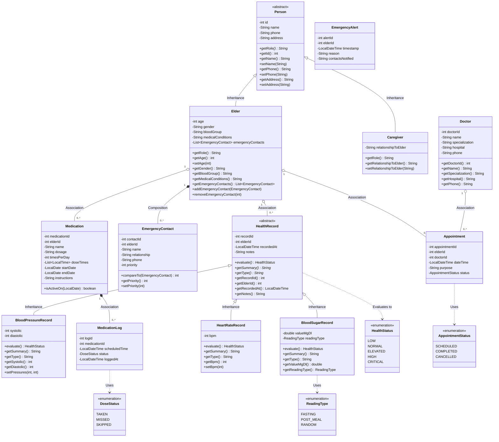
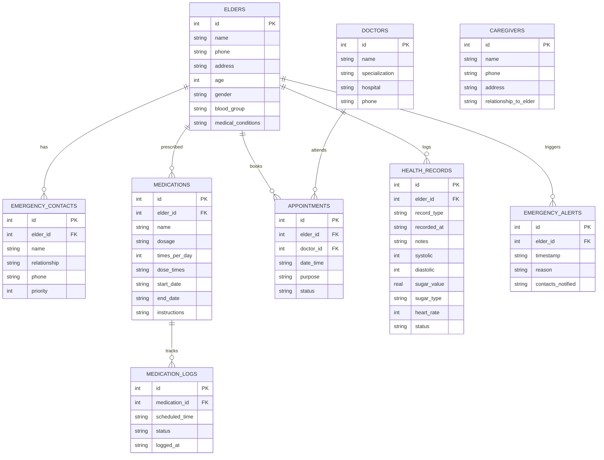

# Elder Care Assistance System - System Design Document

**Course Project:** Object-Oriented Programming (OOP) Mini-Project in Java  
**Target Platform:** Java 17 (LTS), SQLite 3, Maven  
**Package Root:** `com.eldercare`  
**Date:** September 2026  

---

## 1. Project Overview and Objectives

The **Elder Care Assistance System** is a modular, console-based Java application designed to support elderly individuals in living independently, safely, and comfortably. Seniors often face simultaneous challenges such as adhering to complex medication schedules, coordinating frequent doctor appointments, tracking vital health metrics, and swiftly contacting trusted family members or caregivers during emergencies.

This system provides a unified, reliable platform addressing these needs:
1. **Elder & Caregiver Management:** Tracks elder profiles, clinical conditions, attending caregivers, and prioritized emergency contacts.
2. **Medication Scheduling & Reminders:** Manages prescriptions, daily intake schedules, due/overdue dose detection, and compliance analytics.
3. **Doctor Consultation Scheduling:** Coordinates medical visits with proactive conflict detection (e.g. 30-minute buffers for doctors and elders, and past-date rejection).
4. **Health Metric Logging & Polymorphic Monitoring:** Records and clinically evaluates Blood Pressure, Blood Sugar, and Resting Heart Rate using American Heart Association (AHA) and American Diabetes Association (ADA) guidelines.
5. **Emergency Response & Automated Critical Dispatch:** Provides a one-touch SOS alert and triggers automated emergency escalations whenever critical health readings are detected.
6. **Analytical Reporting:** Generates text reports and ASCII dossiers summarizing vitals, moving averages (7-day and 30-day), trajectory trends, and medication compliance.

All information is permanently stored in an SQLite relational database (`eldercare.db`), manipulated strictly via parameterized SQL PreparedStatements, and processed using pure Java business logic.

---

## 2. Object-Oriented Principles Demonstrated

| OOP Principle | Where Demonstrated in the Project | Practical Viva Explanation |
| :--- | :--- | :--- |
| **Encapsulation** | All model classes (`Person`, `Elder`, `Medication`, `HealthRecord`, etc.) | All instance variables are marked `private`. Access and mutation are controlled via public getters and setters. Strict domain validation is enforced in constructors and setters (e.g. 10-digit phone regex, systolic > diastolic check, age 1–130 bounds). Internal collections (such as emergency contact lists and dose times) return unmodifiable views to protect state integrity. |
| **Inheritance** | `Person` &rarr; `Elder`, `Caregiver` `HealthRecord` &rarr; `BloodPressureRecord`, `BloodSugarRecord`, `HeartRateRecord` | Common personal identity attributes (`id`, `name`, `phone`, `address`) are factored into the `Person` superclass, while `Elder` adds geriatric metrics and contacts, and `Caregiver` adds relationship context. Similarly, `HealthRecord` factors shared diagnostic metadata (`recordId`, `elderId`, `recordedAt`, `notes`), specialized by concrete measurement classes. |
| **Abstraction** | `Person` (abstract), `HealthRecord` (abstract), `DAO<T>` (generic interface) | `Person` abstracts the concept of a human participant in the system without committing to a concrete role, defining the abstract method `getRole()`. `HealthRecord` defines the abstract contracts `evaluate()`, `getSummary()`, and `getType()`. The generic `DAO<T>` interface abstracts database persistence operations away from business logic. |
| **Dynamic Polymorphism** | `HealthRecord.evaluate()`, `getSummary()`, and `getType()` | Subclasses override `evaluate()`. A service method or DAO handling a collection of `HealthRecord` references invokes `record.evaluate()` without knowing the concrete type at compile time; Java dynamically dispatches the call to the appropriate subclass method at runtime. |
| **Separation of Concerns** | Layered Architecture: `model` &rarr; `dao` &rarr; `service` &rarr; `ui` | Domain data representation (`model`) is decoupled from raw persistence (`dao`), business rules (`service`), and user interaction (`ui`). |

---

## 3. Class Diagram (Mermaid)

---

## 4. Detailed Class Specifications

### 4.1. Domain Model Hierarchy (`com.eldercare.model`)

#### `Person` (Abstract)
- **Purpose:** Abstract superclass capturing core biographical information shared by system participants.
- **Attributes:**
  - `id: int` &mdash; Unique system identifier.
  - `name: String` &mdash; Full name (validated non-blank).
  - `phone: String` &mdash; Exactly 10 digits (`^\d{10}$`).
  - `address: String` &mdash; Physical residential address.
- **Methods:**
  - `abstract String getRole()` &mdash; Polymorphic discriminator (`Elder`, `Caregiver`).
  - Standard getters and validated setters.

#### `Elder` (Extends `Person`)
- **Purpose:** Represents an elderly patient under assisted care.
- **Attributes:**
  - `age: int` &mdash; Validated between 1 and 130.
  - `gender: String` &mdash; Gender identity.
  - `bloodGroup: String` &mdash; Blood classification (e.g. `O+`, `A-`).
  - `medicalConditions: String` &mdash; Summary of chronic illnesses.
  - `emergencyContacts: List<EmergencyContact>` &mdash; Managed list of emergency responders.
- **Methods:**
  - `getRole()` &mdash; Returns `"Elder"`.
  - `addEmergencyContact(EmergencyContact)` &mdash; Appends contact and re-sorts by priority.
  - `removeEmergencyContact(int contactId)` &mdash; Removes contact by ID.
  - `getEmergencyContacts()` &mdash; Returns an unmodifiable list to maintain encapsulation.

#### `Caregiver` (Extends `Person`)
- **Purpose:** Family member or certified aide managing an elder's daily routine.
- **Attributes:**
  - `relationshipToElder: String` &mdash; Nature of association (e.g. "Daughter", "Professional Aide").
- **Methods:**
  - `getRole()` &mdash; Returns `"Caregiver"`.

#### `Doctor`
- **Purpose:** Licensed healthcare provider consulting with seniors.
- **Attributes:**
  - `doctorId: int` &mdash; Primary key.
  - `name: String` &mdash; Doctor's full name.
  - `specialization: String` &mdash; Medical field (e.g. Cardiology, Geriatrics).
  - `hospital: String` &mdash; Clinic or hospital affiliation.
  - `phone: String` &mdash; 10-digit telephone number.

#### `EmergencyContact` (Implements `Comparable<EmergencyContact>`)
- **Purpose:** Individual to contact during medical emergencies.
- **Attributes:**
  - `contactId: int`, `elderId: int`, `name: String`, `relationship: String`, `phone: String`, `priority: int`
- **Methods:**
  - `compareTo(EmergencyContact other)` &mdash; Natural ordering ascending by priority (`1` before `2`).

#### `Medication`
- **Purpose:** Prescribed medical therapy course.
- **Attributes:**
  - `medicationId: int`, `elderId: int`, `name: String`, `dosage: String`, `timesPerDay: int`, `doseTimes: List<LocalTime>`, `startDate: LocalDate`, `endDate: LocalDate`, `instructions: String`.
- **Methods:**
  - `isActiveOn(LocalDate date)` &mdash; Validates if date is between start and end dates inclusive.

#### `MedicationLog`
- **Purpose:** Records adherence for a specific scheduled dose time.
- **Attributes:**
  - `logId: int`, `medicationId: int`, `scheduledTime: LocalDateTime`, `status: DoseStatus` (`TAKEN`, `MISSED`, `SKIPPED`), `loggedAt: LocalDateTime`.

#### `Appointment`
- **Purpose:** Tracks doctor consultations.
- **Attributes:**
  - `appointmentId: int`, `elderId: int`, `doctorId: int`, `dateTime: LocalDateTime`, `purpose: String`, `status: AppointmentStatus` (`SCHEDULED`, `COMPLETED`, `CANCELLED`).

#### `HealthRecord` (Abstract)
- **Purpose:** Polymorphic foundation for all clinical diagnostics.
- **Attributes:**
  - `recordId: int`, `elderId: int`, `recordedAt: LocalDateTime`, `notes: String`.
- **Abstract Methods:**
  - `abstract HealthStatus evaluate()` &mdash; Evaluates clinical severity (`LOW`, `NORMAL`, `ELEVATED`, `HIGH`, `CRITICAL`).
  - `abstract String getSummary()` &mdash; Human-readable reading summary.
  - `abstract String getType()` &mdash; Type identifier string.

#### `BloodPressureRecord` (Extends `HealthRecord`)
- **Attributes:** `systolic: int`, `diastolic: int`.
- **Evaluation Criteria (AHA):**
  - `CRITICAL`: Systolic $\ge$ 180 or Diastolic $\ge$ 120 (Hypertensive crisis)
  - `LOW`: Systolic $<$ 90 or Diastolic $<$ 60 (Hypotension)
  - `HIGH`: Systolic $\ge$ 130 or Diastolic $\ge$ 80 (Hypertension Stage 1/2)
  - `ELEVATED`: Systolic 120–129 and Diastolic $<$ 80
  - `NORMAL`: Systolic 90–119 and Diastolic 60–79

#### `BloodSugarRecord` (Extends `HealthRecord`)
- **Attributes:** `valueMgDl: double`, `readingType: ReadingType` (`FASTING`, `POST_MEAL`, `RANDOM`).
- **Evaluation Criteria (ADA):**
  - **Fasting:** `CRITICAL` ($< 50$ or $\ge 250$), `LOW` ($< 70$), `NORMAL` (70–99), `ELEVATED` (100–125), `HIGH` (126–249).
  - **Post-Meal / Random:** `CRITICAL` ($< 50$ or $\ge 300$), `LOW` ($< 70$), `NORMAL` (70–139), `ELEVATED` (140–199), `HIGH` (200–299).

#### `HeartRateRecord` (Extends `HealthRecord`)
- **Attributes:** `bpm: int`.
- **Evaluation Criteria:**
  - `CRITICAL`: $< 40$ or $\ge 140$ bpm
  - `LOW`: 40–59 bpm (Bradycardia)
  - `NORMAL`: 60–100 bpm
  - `ELEVATED`: 101–120 bpm
  - `HIGH`: 121–139 bpm

#### `EmergencyAlert`
- **Purpose:** Permanent audit log of emergency events.
- **Attributes:**
  - `alertId: int`, `elderId: int`, `timestamp: LocalDateTime`, `reason: String`, `contactsNotified: String`.

---

### 4.2. Data Access Layer (`com.eldercare.dao`)

- **`DAO<T>` (Generic Interface):** Establishes common persistence signatures: `int add(T)`, `Optional<T> getById(int)`, `List<T> getAll()`, `boolean update(T)`, and `boolean delete(int)`.
- **`DatabaseManager` (Singleton):** Thread-safe singleton opening the connection, setting `PRAGMA foreign_keys = ON;`, creating all 9 tables, and supporting test database switching.
- **`ElderDAO`, `CaregiverDAO`, `DoctorDAO`, `EmergencyContactDAO`, `MedicationDAO`, `MedicationLogDAO`, `AppointmentDAO`, `EmergencyAlertDAO`:** Concrete DAO classes using `PreparedStatement`s.
- **`HealthRecordDAO`:** Implements **Single-Table Inheritance** persistence. Inspects `record_type` upon retrieval to instantiate `BloodPressureRecord`, `BloodSugarRecord`, or `HeartRateRecord` polymorphically.

---

### 4.3. Business Services Layer (`com.eldercare.service`)

- **`ReminderService`:** Computes today's dose schedule, detects due/overdue doses based on current time, records adherence statuses, and calculates adherence percentages per medication and overall for an elder.
- **`AppointmentScheduler`:** Enforces 30-minute conflict buffer for both doctors and elders, prevents past-date bookings, and handles scheduling lifecycles (reschedule, cancel, complete).
- **`HealthMonitor`:** Polymorphically evaluates readings, computes 7-day and 30-day statistical moving averages, analyzes trajectories to detect trends (`Rising`, `Falling`, `Stable`), filters abnormal readings, and automatically delegates to `EmergencyService` when a reading evaluates to `CRITICAL`.
- **`EmergencyService`:** Coordinates manual and automatic SOS events, gathers priority-ordered contacts and doctor info, logs `EmergencyAlert`, and formats emergency dispatch banners.
- **`ReportGenerator`:** Assembles and outputs neatly formatted ASCII text tables for Health Summaries, Medication Adherence, Appointments, and Emergency Alerts.

---

## 5. Relationships Between Classes

1. **Inheritance (Is-A):**
   - `Elder is-a Person`, `Caregiver is-a Person`.
   - `BloodPressureRecord is-a HealthRecord`, `BloodSugarRecord is-a HealthRecord`, `HeartRateRecord is-a HealthRecord`.
2. **Composition (Has-A, strong lifecycle ownership):**
   - `Elder` possesses a list of `EmergencyContact` objects. If an elder is deleted from the database, `ON DELETE CASCADE` removes their emergency contacts.
3. **Association (Uses / Refers to):**
   - `Appointment` associates an `Elder` and a `Doctor` via foreign keys.
   - `MedicationLog` associates a specific scheduled event with a `Medication`.
   - `HealthMonitor` uses `EmergencyService` to automatically escalate critical clinical readings.

---

## 6. Database Schema & Entity-Relationship Design

The SQLite relational database (`eldercare.db`) enforces relational integrity using foreign keys with cascading deletes.

### 6.1. Entity-Relationship Diagram (Mermaid)

### 6.2. Table Definitions

1. **`elders`**: `id` (INTEGER PK AUTOINCREMENT), `name` (TEXT NOT NULL), `phone` (TEXT NOT NULL), `address` (TEXT), `age` (INTEGER NOT NULL), `gender` (TEXT), `blood_group` (TEXT), `medical_conditions` (TEXT).
2. **`caregivers`**: `id` (INTEGER PK AUTOINCREMENT), `name` (TEXT NOT NULL), `phone` (TEXT NOT NULL), `address` (TEXT), `relationship_to_elder` (TEXT NOT NULL).
3. **`doctors`**: `id` (INTEGER PK AUTOINCREMENT), `name` (TEXT NOT NULL), `specialization` (TEXT NOT NULL), `hospital` (TEXT NOT NULL), `phone` (TEXT NOT NULL).
4. **`emergency_contacts`**: `id` (INTEGER PK AUTOINCREMENT), `elder_id` (INTEGER FK &rarr; elders(id) ON DELETE CASCADE), `name` (TEXT NOT NULL), `relationship` (TEXT NOT NULL), `phone` (TEXT NOT NULL), `priority` (INTEGER NOT NULL).
5. **`medications`**: `id` (INTEGER PK AUTOINCREMENT), `elder_id` (INTEGER FK &rarr; elders(id) ON DELETE CASCADE), `name` (TEXT NOT NULL), `dosage` (TEXT NOT NULL), `times_per_day` (INTEGER NOT NULL), `dose_times` (TEXT NOT NULL), `start_date` (TEXT NOT NULL), `end_date` (TEXT NOT NULL), `instructions` (TEXT).
6. **`medication_logs`**: `id` (INTEGER PK AUTOINCREMENT), `medication_id` (INTEGER FK &rarr; medications(id) ON DELETE CASCADE), `scheduled_time` (TEXT NOT NULL), `status` (TEXT NOT NULL), `logged_at` (TEXT NOT NULL).
7. **`appointments`**: `id` (INTEGER PK AUTOINCREMENT), `elder_id` (INTEGER FK &rarr; elders(id) ON DELETE CASCADE), `doctor_id` (INTEGER FK &rarr; doctors(id) ON DELETE CASCADE), `date_time` (TEXT NOT NULL), `purpose` (TEXT NOT NULL), `status` (TEXT NOT NULL).
8. **`health_records`**: `id` (INTEGER PK AUTOINCREMENT), `elder_id` (INTEGER FK &rarr; elders(id) ON DELETE CASCADE), `record_type` (TEXT NOT NULL), `recorded_at` (TEXT NOT NULL), `notes` (TEXT), `systolic` (INTEGER), `diastolic` (INTEGER), `sugar_value` (REAL), `sugar_type` (TEXT), `heart_rate` (INTEGER), `status` (TEXT NOT NULL).
9. **`emergency_alerts`**: `id` (INTEGER PK AUTOINCREMENT), `elder_id` (INTEGER FK &rarr; elders(id) ON DELETE CASCADE), `timestamp` (TEXT NOT NULL), `reason` (TEXT NOT NULL), `contacts_notified` (TEXT NOT NULL).
